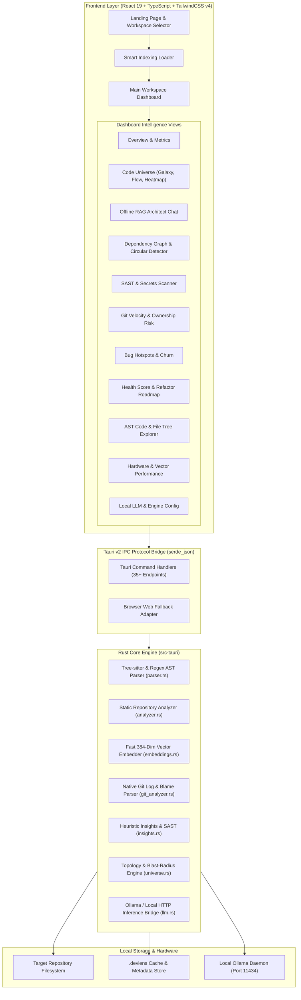
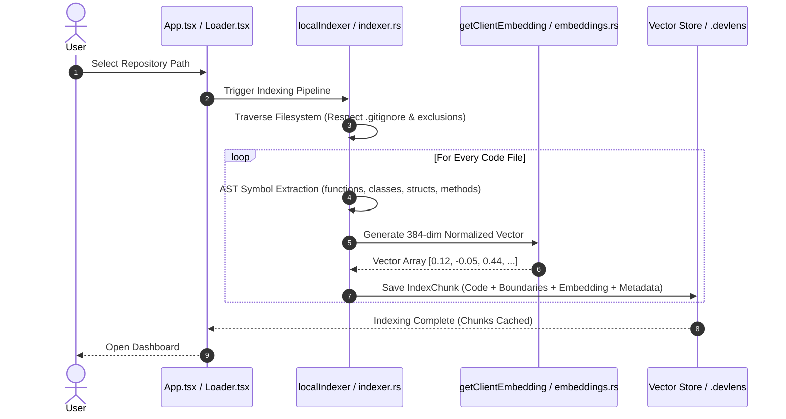
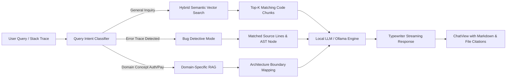

# DevLens AI — Complete Technical Architecture & System Documentation

> **"Understand Any Codebase. Entirely On Your Machine."**

---

## 1. Executive Summary & Vision

**DevLens AI** is a production-grade, 100% offline, privacy-first repository intelligence desktop platform. It empowers software engineers, security auditors, engineering leads, and technical architects to understand, visualize, search, and converse with complex codebases without any source code leaving their local workstation.

### Core Value Propositions
* **Zero Cloud Exfiltration**: Zero telemetry, zero external API keys required, zero telemetry tracking. All vector embeddings, AST parsing, Git commit analytics, and LLM inferences occur locally.
* **Hybrid Semantic & AST Graph Indexing**: Combines Tree-sitter AST symbol trees, dependency graphs, and 384-dimensional local vector embeddings.
* **Sub-50ms Local Code Retrieval**: Fast lexical-semantic hybrid search with cosine similarity and polynomial hashing projection.
* **Interactive Code Universe**: 2.5D visual topology, architecture galaxy, execution flow maps, and blast-radius impact analysis.
* **Autonomous Engineering Insights**: Cyclomatic complexity scoring, secret leakage detection, circular import loop detection, and bus-factor / knowledge silo mitigation.

---

## 2. High-Level System Architecture

DevLens AI is built as a hybrid desktop application utilizing **Tauri v2 (Rust)** for system-level operations and high-performance parsing, and **React 19 + TypeScript + Tailwind CSS v4** for the user interface.



---

## 3. Technology Stack & Component Matrix

| Layer | Technologies | Role / Responsibility |
| :--- | :--- | :--- |
| **Desktop Shell** | Rust 2021, Tauri v2 (`@tauri-apps/api` v2, `tauri-plugin-opener`) | Window management, OS filesystem access, multi-threaded CPU concurrency. |
| **Frontend Framework** | React 19 (`react`, `react-dom`), TypeScript 5.8, Vite 7 | Component state tree, reactivity, and client-side view orchestration. |
| **Styling & Design System** | Tailwind CSS v4 (`@tailwindcss/vite`), Custom Glassmorphism CSS | Responsive dark-mode aesthetics, custom HUD panels, glow effects. |
| **Graph Visualization** | `@xyflow/react` (React Flow), Canvas 2D, SVG rendering | Interactive dependency trees, architectural flows, and node clusters. |
| **Animations & FX** | `framer-motion`, `canvas-confetti`, `lucide-react` | Fluid transitions, indexing stage celebrations, and icon sets. |
| **Parsing & Graph Analysis** | `walkdir`, `ignore`, `petgraph`, `sha2`, `notify` (Rust) | Ignoring `.gitignore` paths, topological sorting, and cycle detection. |
| **Vector & RAG Engine** | Polynomial Hashing Projection (384-dim), Cosine Similarity, Nomic Vector fallback | Fast local code search without requiring heavy external Python runtimes. |
| **Local LLM Engine** | Ollama IPC / HTTP (`qwen2.5-coder:3b`, `llama3`, `deepseek-coder`) | Local code explanation, contextual Q&A, bug detective debugging. |

---

## 4. Detailed Component & Module Breakdown

### 4.1 Frontend Architecture (`src/`)

```
src/
├── App.tsx                     # Top-level state coordinator (Landing -> Loader -> Dashboard)
├── main.tsx                    # React root entrypoint
├── index.css                   # Global design tokens, scrollbars, and glassmorphism utilities
├── types/
│   └── index.ts                # TypeScript domain models (Repository, AST Node, Graph, RAG)
├── hooks/
│   ├── useActiveRepo.ts        # Active workspace state, metadata caching, and hot-reload
│   └── useRecentRepos.ts       # History persistence, recents ranking, and workspace removal
├── services/
│   ├── backend.ts              # Unified IPC router (Tauri Native IPC <-> Browser Mock/TS Fallback)
│   ├── analyzer.ts             # Language detection, framework heuristics, DFS cycle detector
│   ├── architect.ts            # Typewriter RAG streaming, bug detective analysis, code citations
│   ├── indexer.ts              # Smart chunker, 384-dim embeddings generator, cosine ranker
│   ├── insights.ts             # Health scoring (6 pillars), code smells, refactor roadmap
│   ├── gitHistory.ts           # Commit timeline, file evolution, impact analysis, ownership
│   └── universe.ts             # Code Universe topology, execution flows, directory heatmap
└── components/
    ├── LandingPage.tsx         # Hero banner, repository path picker, and recent repos selector
    ├── Loader.tsx              # Dynamic 4-stage animated indexing progress HUD
    ├── Header.tsx              # Breadcrumbs, quick search trigger (⌘K / Ctrl+K), and branch indicators
    ├── Sidebar.tsx             # Collapsible navigation rail with badge counts and view switching
    ├── SearchModal.tsx         # Spot-search modal with hybrid vector ranking and code preview
    ├── Dashboard.tsx           # Main workspace view shell
    └── dashboard/
        ├── OverviewView.tsx    # High-level statistics, language bar, quick action shortcuts
        ├── CodeUniverseView.tsx# 4-in-1 Universe: Galaxy, Execution Flow, Heatmap, Timeline
        ├── ArchitectureView.tsx# Layered architecture diagram, components list, and rules
        ├── DependenciesView.tsx# Interactive file dependency graph with circular reference warnings
        ├── ExplorerView.tsx    # AST symbol tree explorer, cyclomatic score, function inspector
        ├── GitView.tsx         # Commit history velocity, blame ownership, bus-factor risk
        ├── HotspotsView.tsx    # High-risk file heatmap, complexity vs churn scatter
        ├── InsightsView.tsx    # 6-pillar repository health report card and action plan
        ├── SecurityView.tsx    # Static SAST security findings, hardcoded secrets, eval detector
        ├── RoadmapView.tsx     # Guided codebase onboarding checklist with files and explanations
        ├── PerformanceView.tsx # Memory footprint, vector database stats, system diagnostics
        ├── SettingsView.tsx    # Local LLM model switcher, thread concurrency, ignore lists
        └── ChatView.tsx        # AI Codebase Architect chat with code citations and prompts
```

---

## 5. Core Data Pipelines & Algorithms

### 5.1 Local Semantic Indexing Pipeline



#### The Hashing Projection Trick (`getClientEmbedding`)
To avoid requiring multi-gigabyte Python PyTorch/ONNX runtimes for basic local search, DevLens implements a fast polynomial hashing projection:
1. Tokenizes code snippets into normalized sub-words.
2. Projects words across a 384-dimensional feature vector using polynomial hash functions (`hash1 = ((hash1 << 5) + hash1) + char`).
3. Applies alternating sign hashing (`hash2 % 2 === 0 ? 1 : -1`) to minimize feature collisions.
4. Normalizes vector via L2-norm Euclidean magnitude: $\mathbf{v}_{norm} = \frac{\mathbf{v}}{\|\mathbf{v}\|_2}$.

#### Hybrid Search Scoring Formula
$$\text{Score} = (\text{CosineSim} \times 0.5) + (\text{KeywordMatch} \times 0.3) + (\text{SymbolImportance} \times 0.2)$$

---

### 5.2 Circular Dependency Detection Algorithm
In `src/services/analyzer.ts` and `src-tauri/src/analyzer.rs`, circular dependency loops are discovered using a depth-first search (DFS) algorithm with recursion stack tracking:
* **Time Complexity**: $\mathcal{O}(V + E)$ where $V$ is file count and $E$ is import edge count.
* **Stack State**: Maintains `visited` set and `inStack` set to detect back-edges.
* **Cycle Reconstruction**: When a back-edge is detected (`inStack.has(neighbor)`), the cycle is sliced directly from the stack and surfaced in the Dependencies View with remediation instructions.

---

### 5.3 Local RAG Architect & Bug Detective Pipeline



---

## 6. Rust Tauri Native IPC API Reference

The Rust backend exposes 35+ strongly-typed Tauri IPC commands:

### Repository & Metadata Commands
| Command | Arguments | Return Type | Description |
| :--- | :--- | :--- | :--- |
| `scan_repository` | `path: String` | `RepoMetadata` | Reads directory metadata, commits, and languages. |
| `parse_repository` | `path: String` | `RepositoryStats` | Computes LoC, classes, functions, and trait counts. |
| `load_analysis` | `path: String` | `String (JSON)` | Loads cached `.devlens/metadata.json`. |
| `folder_tree` | `path: String, folder_path: String` | `FolderExplanation` | Explains folder purpose and risk level. |
| `dependency_graph`| `path: String` | `DependencyGraph` | Returns all import nodes, edges, and cycles. |

### Vector Indexing & Search Commands
| Command | Arguments | Return Type | Description |
| :--- | :--- | :--- | :--- |
| `index_repository` | `path: String` | `String` | Indexes whole repository into local chunks. |
| `embed_chunks` | `chunks: Vec<String>` | `Vec<Vec<f32>>` | Computes 384-dimensional vector embeddings. |
| `semantic_search` | `path: String, query: String, limit: usize` | `Vec<SearchResult>` | Performs hybrid cosine vector search. |
| `delete_repository_index`| `path: String` | `String` | Purges local `.devlens` index cache. |

### AI Engineering & Insights Commands
| Command | Arguments | Return Type | Description |
| :--- | :--- | :--- | :--- |
| `get_repository_insights`| `path: String` | `RepositoryInsights` | 6-category health scores, smells, and SAST findings. |
| `security_scan` | `path: String` | `Vec<SecurityScanFinding>` | Scans for hardcoded tokens, SQLi, and eval. |
| `detect_code_smells` | `path: String` | `Vec<CodeSmell>` | Identifies God components and duplicated logic. |
| `generate_refactoring_plan`| `path: String` | `Vec<String>` | Step-by-step refactoring priority list. |

### Git & Code Universe Commands
| Command | Arguments | Return Type | Description |
| :--- | :--- | :--- | :--- |
| `analyze_git_history` | `path: String` | `Vec<GitCommit>` | Parses local git log commits and authors. |
| `get_file_history` | `path: String, file_path: String` | `Vec<FileHistoryItem>` | Evolution log of a specific file. |
| `analyze_change_impact`| `path: String, file_path: String` | `ImpactResult` | Computes downstream blast-radius. |
| `get_code_ownership` | `path: String` | `Vec<OwnerContribution>` | Calculates developer contribution percentages. |
| `calculate_knowledge_risk`| `path: String` | `Vec<KnowledgeRisk>` | Highlights single points of failure (bus factor). |
| `generate_code_universe`| `path: String` | `CodebaseUniverse` | Compiles nodes, edges, execution flows, and heatmaps. |

---

## 7. Security, Privacy & Offline Guarantees

1. **Zero Remote Outbound Requests**: All core analysis algorithms execute entirely on the host machine.
2. **Private Data Isolation**: Vector indexes and AST metadata are stored strictly in the `.devlens/` folder within the scanned project or OS app data directories.
3. **No External Cloud AI Dependency**: The application connects to `http://localhost:11434` for Ollama or runs local TypeScript/Rust heuristic engines when Ollama is offline.
4. **Credential Safety**: The built-in SAST scanner detects and flags accidental API key commits (`sk_live_...`, tokens, private keys) before code is pushed upstream.

---

## 8. Development & Operational Playbook

### Prerequisites
* Node.js v18+ & npm
* Rust 1.75+ with `cargo`
* (Optional) Ollama with `qwen2.5-coder:3b`

### Available Scripts
```bash
# 1. Install frontend dependencies
npm install

# 2. Run Vite local development preview
npm run dev
# Accessible at: http://localhost:1420/

# 3. Run Tauri desktop application with Rust hot-reload
npm run tauri dev

# 4. Compile production distribution bundle
npm run build
npm run tauri build
```

---

## 9. Future Roadmap & Enhancement Horizons

1. **Native Tree-sitter WASM / C bindings**: Integrate direct Tree-sitter C grammar bindings inside Rust for deeper syntax tree generation across 20+ programming languages.
2. **LanceDB Embedded Vector Storage**: Embed native LanceDB SQLite/Arrow-based vector database for millions of vectors per repository.
3. **PR Simulation & Blast-Radius Pre-flight**: Virtual merge conflict and downstream impact simulator directly inside the Git View.
4. **Automated Unit Test & Refactor Synthesizer**: One-click generation of Vitest / PyTest / Rust unit tests for high-complexity functions.
