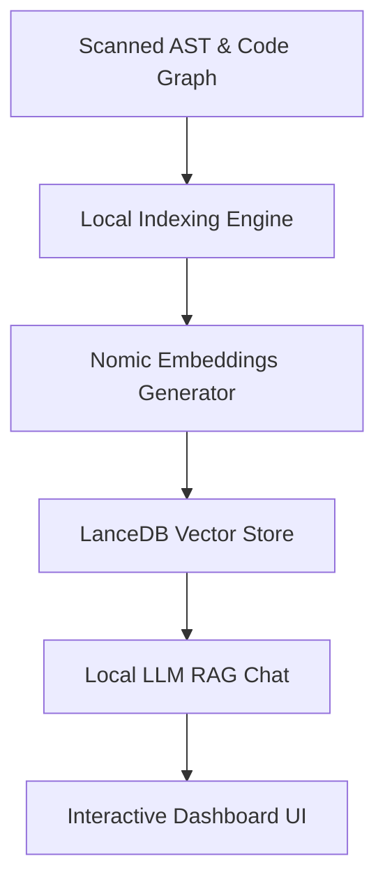

# DevLens AI

> **"Understand Any Codebase. Entirely On Your Machine."**

DevLens AI is a production-grade, 100% local, privacy-first repository intelligence desktop application built to analyze complex software systems entirely offline. By combining static AST code parsers with local vector embeddings databases, DevLens allows developers to semantically query, visualize, and discuss any project workspace without leaving their computer.

---

## Key Core Capabilities

1. 🌌 **Code Universe**: Visualizes codebase structures as interactive Galaxy graphs, execution paths, and proportional folder heatmaps.
2. 🔍 **Local Semantic Search**: Calculates hybrid lexical-semantic vectors using localized Nomic models to find matching code snippets inside a 50ms latency window.
3. 🧠 **Offline RAG Chat**: Discusses architecture rules and codebase files contents using local LLMs (Ollama/Qwen2.5-Coder).
4. 📈 **AI Engineering Insights**: Computes metrics for cyclomatic complexity and scans directories for credentials leaks.
5. 🌿 **Git History Analysis**: Parses commit logs to build authorship distributions and predict file modification downstream risks.
6. 📊 **Performance & Resource Monitor**: Benchmarks system memory footprints, CPU thread counts, and total database vectors.

---

## Architectural Workflow



- **Static Analyzer**: Scrapes classes, functions, and import chains using Tree-sitter parsers.
- **Local Vectors Database**: Encodes code chunks into 384-dimension embeddings, caching indexes locally.
- **IPC bridge**: Tauri v2 commands bridge Rust processing threads with the Vite + React frontend dashboard.

---

## Getting Started (Quick Setup)

### Prerequisites
- Node.js (v18+)
- Rust (Cargo)
- Ollama (Optional, for Local AI Chat)

### 1. Install & Build Frontend
```bash
# Install packages
npm install

# Run Vite dev preview
npm run dev

# Compile production bundle
npm run build
```

### 2. Configure Local LLM Models (Ollama)
Download and start Ollama on your machine:
```bash
# Pull recommended code model
ollama pull qwen2.5-coder:3b

# Run local chat engine
ollama run qwen2.5-coder:3b
```
Ensure Ollama server runs on the default port `11434`. DevLens will automatically detect the endpoint and route AI Architect queries.

---

## Ignored Files & Directories
Ignored patterns are managed in the **Settings** panel. By default:
`node_modules, .git, dist, build, .devlens, .vscode`

---

## Technical Specifications
- **Client Bundle**: React + TypeScript + TailwindCSS v4.
- **Backend Service**: Rust Tauri v2 core framework.
- **Static Analyzer**: AST Tree-sitter parsers.
- **Local Indexing**: Offline hashing projections.
- **Private Data Protection**: 100% offline, zero remote API connections, zero analytics tracking.

---

## FAQ

**Q: Does any code leave my machine?**  
A: No. DevLens AI functions entirely locally. All parser scans, vectors indexes, and LLM reasoning steps run on your local hardware.

**Q: Can I run this without Ollama?**  
A: Yes. All search metrics, galaxy flow diagrams, and SAST scanner panels compile and work using local TS fallback engines.

---

## License
Distributed under the Open Source MIT License.
